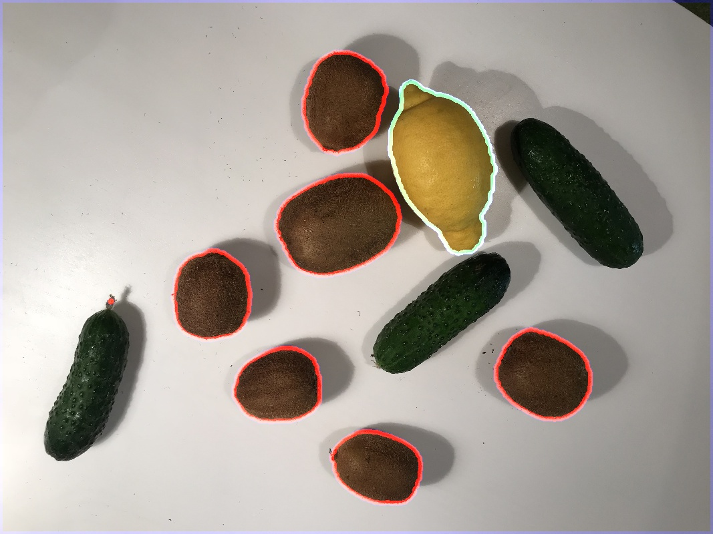
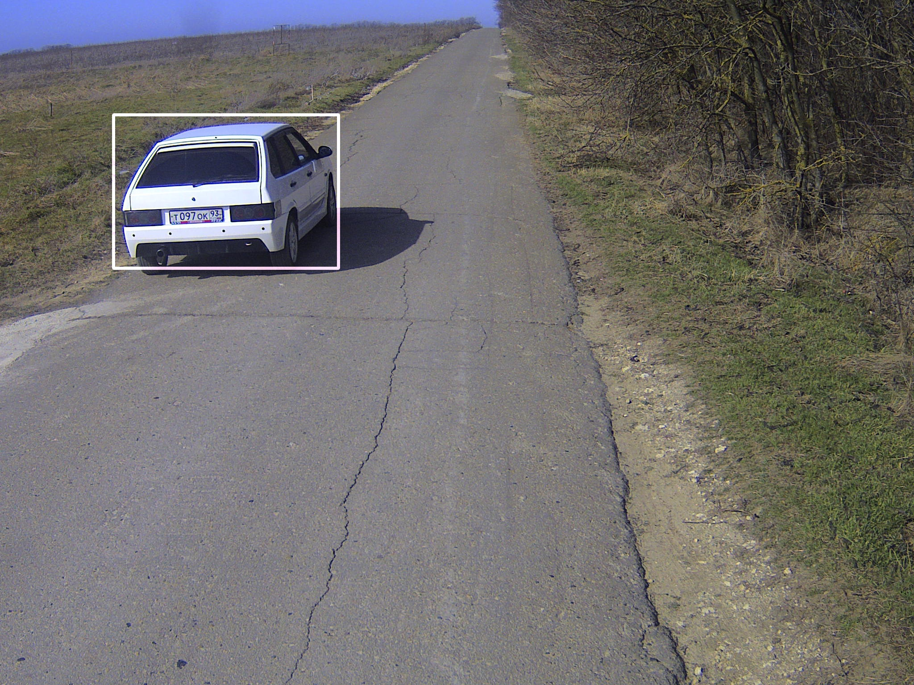
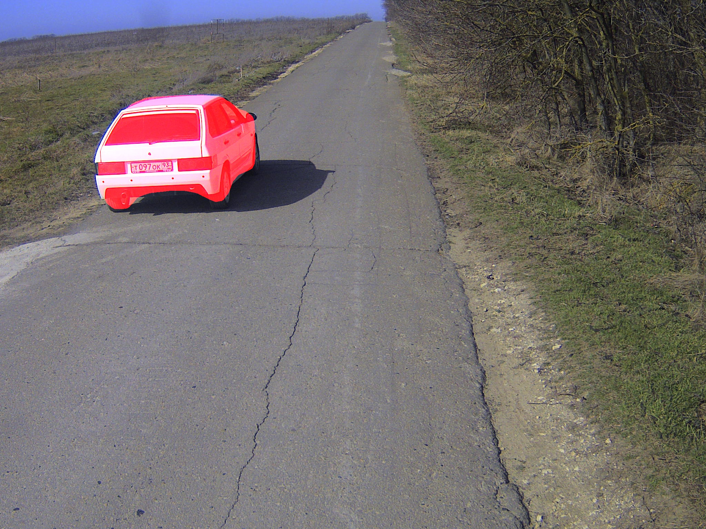

# Description
This tutorial explains how to apply neural network (that was trained in Supervisely) to an image from source code. It helpful for cases, when you are going to integrate NN inference to your source code.

Also, we have the tutorial that demonstrates the other possible ways of how to deploy and apply models. Please, fing them [here](../../../../README.md). The most popular tutorial from that section is ["Different ways of model deployment and and sending HTTP inference requests"](../../../../04_deploy_neural_net_as_api/deploy-model.md) 


# Clone repository

Clone our public repository to some folder on your computer. This repo contains entire Supervisely SDK. Installation via PIP will be added soon.

``` 
git clone https://github.com/supervisely/supervisely.git <your path to folder>
```

In my case it is `/home/max/supervisely`:
``` 
git clone https://github.com/supervisely/supervisely.git /home/max/supervisely
```

# Go to tutorial sources
``` 
cd <path to clonned repo>/help/jupyterlab_scripts/src/tutorials/13_nn_inference_from_sources
```

In my case the command is the following:
``` 
cd /home/max/supervisely/help/jupyterlab_scripts/src/tutorials/13_nn_inference_from_sources
```

# Preparation with NN weights

We attached images and NN weights to this tutorial for you to reproduce it. Please, run the following script to download example models for UNet (lemons), MaskRCNN (COCO) and YOLO (COCO):

```
./download_models.sh
```

# Run python script

## Install needed packages or use prepared Docker images
For each Neural Network (UNet, YOLO, Mask-RCNN) we are using ready docker images where necessary packages are installed. You can use commands in [Docker files](https://github.com/supervisely/supervisely/tree/master/base_images) to install requirements on your machine/environment:
- [YOLO dockerfile](https://github.com/supervisely/supervisely/blob/master/plugins/nn/yolo_v3/Dockerfile) 
- [UNet dockerfile](https://github.com/supervisely/supervisely/blob/master/base_images/pytorch/Dockerfile)
- [Mask-RCNN dockerfile](https://github.com/supervisely/supervisely/blob/master/base_images/tensorflow/Dockerfile).   


## Go to execution environment

In out case the execution environment is Docker container. Let's run the container. Template command is the following:

```
nvidia-docker run --rm -it \
	-v <path to Supervisely repo>:/my_example/supervisely \
	-v <path to model dir>:/sly_task_data/model \
	-v <path to the directory with demo images>:/my_example/images \
	-v <path to inference script>:/my_example/inference.py \
	-w "/my_example" \
	<docker image> python /my_example/inference.py
```

We prepared the shell scripts for every model. Just run `<model_name>_run.sh`, for example `unet_run.sh` or `yolo_run.sh`

# UNet inference

Python script - [`./src/inference_unet.py`](./src/inference_unet.py). Once you execute `./unet_run.sh`, script will produce 
- image with visualized predictions - `./data/images/IMG_0315_unet_inference_visualization.jpeg` 
- predictions in Supervisely Annotation json format - `./data/images/IMG_0315_unet_prediction.json`

Here is the output:

| Input image              |  Visualized prediction   |
:-------------------------:|:-------------------------:
 | 


# YOLO inference

Python script - [`./src/inference_yolo.py`](./src/inference_yolo.py). Once you execute `./yolo_run.sh`, script will produce 
- image with visualized predictions - `./data/images/00000220_yolo_inference_visualization.png` 
- predictions in Supervisely Annotation json format - `./data/images/00000220_yolo_prediction.json`

Here is the output:

| Input image              |  Visualized prediction   |
:-------------------------:|:-------------------------:
 | 


# Mask-RCNN inference

Python script - [`./src/inference_maskrcnn.py`](./src/inference_maskrcnn.py). Once you execute `./maskrcnn_run.sh`, script will produce 
- image with visualized predictions - `./data/images/00000220_maskrcnn_inference_visualization.png` 
- predictions in Supervisely Annotation json format - `./data/images/00000220_maskrcnn_prediction.json`

Here is the output:

| Input image              |  Visualized prediction   |
:-------------------------:|:-------------------------:
 | 


# Important notice
As you can see, scripts [`./src/inference_unet.py`](./src/inference_unet.py), [`./src/inference_yolo.py`](./src/inference_yolo.py), [`./src/inference_maskrcnn.py`](./src/inference_maskrcnn.py) differ only in one line. It is because almost all models in Supervisely have the same API. It allows to quickly apply diferent models in a single manner. 


# Done!