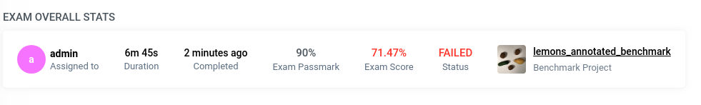
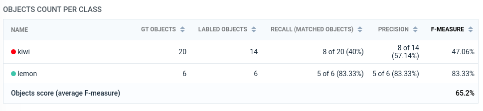
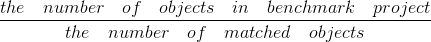
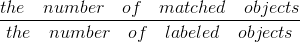
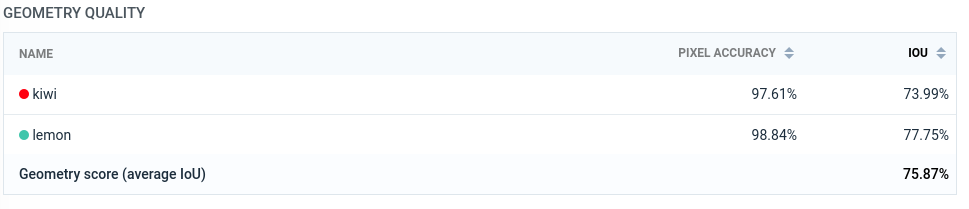
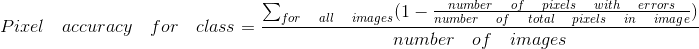
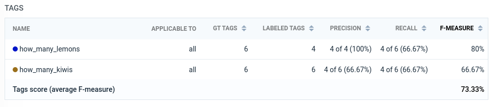
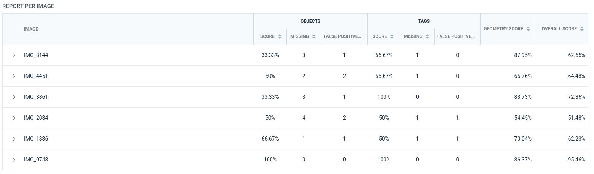
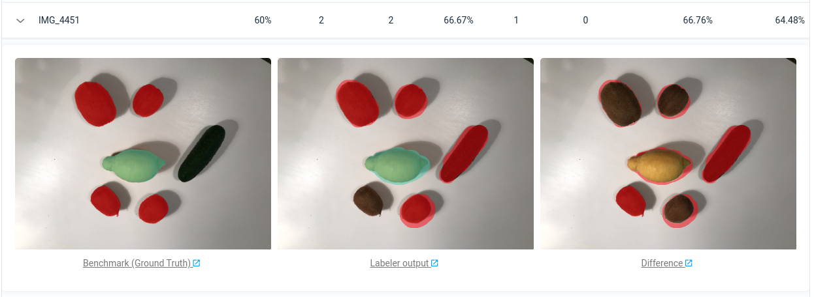

# Exam report explanation

Bief information about Labeling Exams you can find [here](https://medium.com/deep-systems/labeling-guides-exams-new-supervisely-tools-to-teach-workforce-on-your-custom-labeling-task-356095941482)

Let's take a look at the report. It consists of several parts:
1. Overall stats
2. Objects count per class
3. Geometry quality
4. Tags
5. Report per image

# Overall stats

Overall stats shows:
* Who was assigned to exam
* How much time labeler spent on the exam (duration)
* Exam passmark - it is a minimum quality threshold (in percents) that should be achieved
* Exam score - overall quality of the labeling. This value considers a lot of different metrics, that will be discussed below. Color indicates whether the exam is passed (green) or not (red)
* Link to original benchmark project - benchmark project is a gold standart for the labeling tasks. It should contain both basic and edge labeling cases. The more diverse it is, the fairer the labeler’s assessment will be.

NOTICE: Currently, Exams module supports basic geometries (polygon, bitmap, rectangle) and objects/images tags. Polyline and graph (keypoints)  geometries will be supported in next release. 

Before we dive into metrics calculation, there is a essential step for the entire process: objects matching.

# How objects are matched together

## Remember what objects order is

Let’s consider semantic segmentation for self-driving car. How to label objects on complex scenes: with or without intersection? Best practice is to annotate objects with intersection and then arrange their order. Opacity tool helps to see final segmentation in real time during annotation. Supervisely supports these features out of the box. Many public datasets are labeled the same way (Cityscapes, Mappilary). For most cases it is considered as a best practice.

## Objects matching

1. Render all objects of all classes to get effective masks (it means that objects masks will be without intersections after rendering, i.e. each pixel belongs to only a one object/class). See example illustration above (when opacity equals to 1) 
2. Every object, that was created by labeler, is compared against all objects of the same class on the same image in benchmark project. For every comparing pair of objects we calculate IoU (find more intuition and theory about IoU metric [here](https://supervise.ly/explore/plugins/m-io-u-69819/overview)) and choose the pair with the maximum value. If the maximum IoU value is less then 0.8 the matching pair is skipped (it means that labeled object was not matched).  

As a result we find both matched and don't matched objects according to IoU threshold. 

NOTICE: right now it is not possible to change IoU matching threshold (default value == 0.8). In next release this parameter will be added to the "Create exam" page and will be available for customization. 

# Objects count per class

Let's start with the first metric that is used in Exam Score calculation. First of all, regardless of pixel-level quality, it is a good idea to validate how labeler understands task by counting how much objects were labeled and how this number correlates with the Ground Truth (GT) objects count. 

But there is one tricky moment here. Let's consider example: labeler have to label persons on an image. Let's say, there are 5 persons in GT annotation. Labeler just randomly labeled 5 areas on the image. If we compare only the number of objects and overlooking their locations, the objects score will be 100% (number of labeled objects == 5, number of objects in GT == 5, 5 == 5 => success). This is how all quiz-based systems work. For labeling examination it is not enough. That is why we match objects before calculation of Objects Count score.

Columns of table "Objects count per class"
- GT Objects - the total number of objects of corresponding class in Benchmark Project
- Labeled Objects - the total number of objects of corresponding class in Labeled Project

- Recall (Matched objects)  

- Precision  

- F-measure (F1 score) [wiki](https://en.wikipedia.org/wiki/F1_score). It is a combination of both precision and recall. F-measure is calculated for every object class. 

**Object Score** is an average of all F-measures of classes. The title of the column that is used for averaging is marked in bold. 

**Object Score** is a first component of **Exam Score**.    

# Geometry quality

For every class (! not for every object instance !) we firstly render the effective mask (Class effective mask) (i.e. it is a rendering of all effective masks of all class objects). And now we have GT and Labeled class effective masks for all images.

- Pixel accuracy equation 

Intuition is the following: for every image we can calculate Pixel Accuracy. Pixel Accuracy = 1 - Pixel Error. Pixel error is a fraction of how many pixels we labeled with errors and the total number of pixels.   

- Intersection over Union - explanation is [here](https://supervise.ly/explore/plugins/m-io-u-69819/overview)

**Geometry Score** is the average of all IoU of classes. The title of the column that is used for averaging is marked in bold.

**Geometry Score** is the second component of **Exam Score**.

# Tags Score

Tags score calculation is similar to objects count calculation and based on objects matching. First of all, we compare GT and Labeled tags that are assigned to corresponfing images. Tag is considered as matched if tag type and tag value (optional) are equial to GT. We calculate such comparison for image tags and for all tags of matched objects.

Intuition behind precision: how many labeled tags are matched.

Intuition behind recall: how many GT tags are matched.

- F-measure (F1 score) [wiki](https://en.wikipedia.org/wiki/F1_score). It is a combination of both precision and recall. F-measure is calculated for every type of tag. 

If exam does not contain tags, **Tags Score** is ignored during **Exam score** calculation.

# Report per image

Table allows to sort images by interested field. For example, you can quickly find images with lowest geometry score, or images with the most mismatched objects. Fields are the same like in tables we described but all values are calculated for a single image.

Also for every image you can see the detailed report. You will see the GT, labeled image, and the difference. Red color indicates the mistaked - differences in labeling on pixel level for any class. If the pixel is red, it means that class of the pixel in GT differs from the class in the labeling. 

Under every image you will find a link to labeling interface. It is useful when you would like to zoom and navigate the difference/GT/labeling. Links are available only to users with corresponding permissions (user with role "labeler" does not see the links). 

# Exam score

**Exam score** is the avarage of objects count score, tags score (optional) and geometry score. These values are marked in bold in corresponding tables.  
