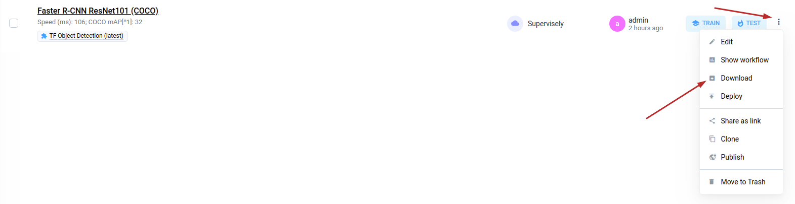
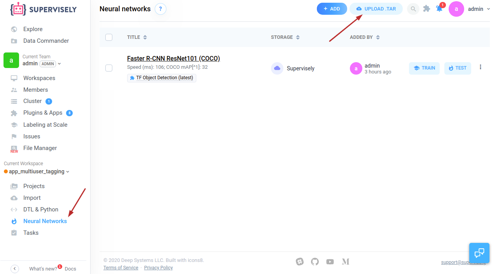
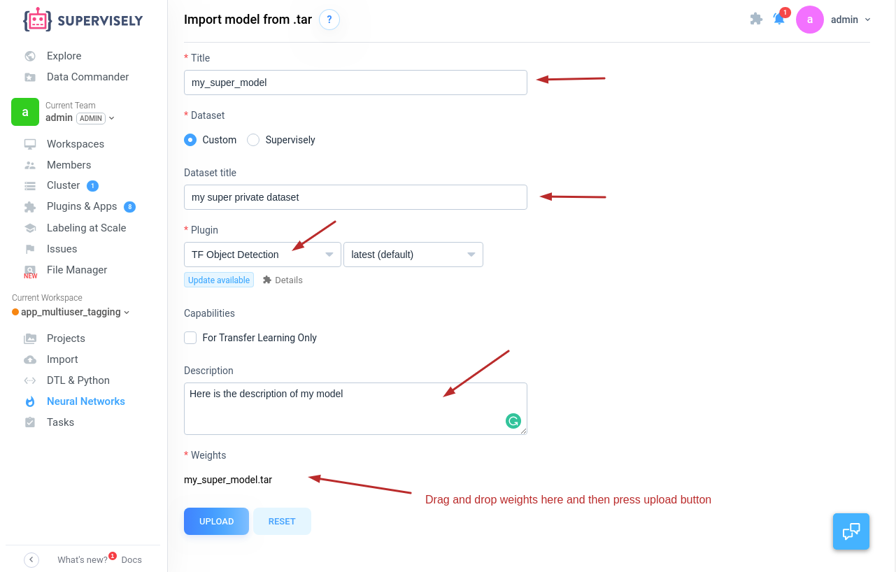
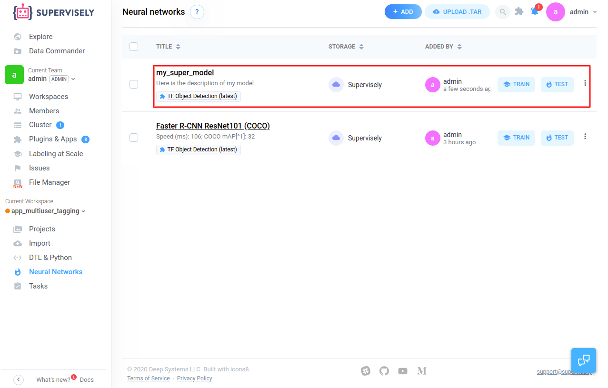

# How to attach model trained outside the Supervisely platform 

Let's consider the following scenario: for some reasons you decided to train model outside Supervisely. And you use well known public implementation. If this implementation already integrated to the platform, this guide is for you. List of already integrated NNs can be found in **Explore ->** (**Models** or **Plugins**) sections.  Otherwise, before using your model in Supervisely, you need to add NN Plugin to the platform ([link to docs](../../README.md)).  For example we trained `Faster R-CNN ResNet101`.


## Step 1. Try to find relevant model in Explore->Models  

Add model to your current workspace, then go to `Neural Networks` page and click "Three dots button"->"Download". Once you download an archive, you can pack you model in a similar way. 



Let's unpack it and look at the structure of directory `Faster R-CNN ResNet101 (COCO)`:

```
.
├── config.json
├── model.config
└── model_weights
    ├── model.ckpt.data-00000-of-00001
    ├── model.ckpt.index
    └── model.ckpt.meta
```

Ok, let's look at our model weights:

```
.
├── model.ckpt-600000.data-00000-of-00001
├── model.ckpt-600000.index
└── model.ckpt-600000.meta
```

## Step 2. Rename model weights

In this example, our model has name `model.ckpt-600000` , let's rename it to just `model.ckpt`. As a result we have the following

```
.
├── model.ckpt.data-00000-of-00001
├── model.ckpt.index
└── model.ckpt.meta
```

## Step 3. Prepare correct folder structure

Put your weights to directory `model_weights` and put `config.json` and `model.config` to the same level. result will look like:

```.
├── config.json
├── model.config
└── model_weights
    ├── model.ckpt.data-00000-of-00001
    ├── model.ckpt.index
    └── model.ckpt.meta
```

## Step 4. File `model.config`

Be sure, that you put correct TF model configuration. It may looks something like this:

```
model {
  faster_rcnn {
    num_classes: 3
    image_resizer {
      keep_aspect_ratio_resizer {
        min_dimension: 1096
        max_dimension: 1368
      }
    }
    feature_extractor {
      type: "faster_rcnn_resnet101"
      first_stage_features_stride: 16
    }
    first_stage_anchor_generator {
      grid_anchor_generator {
        height_stride: 16
        width_stride: 16
        scales: 0.25
        scales: 0.5
        scales: 1.0
        scales: 2.0
        aspect_ratios: 0.5
        aspect_ratios: 1.0
        aspect_ratios: 2.0
      }
    }
    first_stage_box_predictor_conv_hyperparams {
      op: CONV
      regularizer {
        l2_regularizer {
          weight: 0.0
        }
      }
      initializer {
        truncated_normal_initializer {
          stddev: 0.01
        }
      }
    }
    first_stage_nms_score_threshold: 0.0
    first_stage_nms_iou_threshold: 0.7
    first_stage_max_proposals: 50
    first_stage_localization_loss_weight: 2.0
    first_stage_objectness_loss_weight: 1.0
    initial_crop_size: 14
    maxpool_kernel_size: 2
    maxpool_stride: 2
    second_stage_box_predictor {
      mask_rcnn_box_predictor {
        fc_hyperparams {
          op: FC
          regularizer {
            l2_regularizer {
              weight: 0.0
            }
          }
          initializer {
            variance_scaling_initializer {
              factor: 1.0
              uniform: true
              mode: FAN_AVG
            }
          }
        }
        use_dropout: false
        dropout_keep_probability: 1.0
      }
    }
    second_stage_batch_size: 10
    second_stage_post_processing {
      batch_non_max_suppression {
        score_threshold: 0.0
        iou_threshold: 0.6
        max_detections_per_class: 10
        max_total_detections: 10
      }
      score_converter: SOFTMAX
    }
    second_stage_localization_loss_weight: 2.0
    second_stage_classification_loss_weight: 1.0
  }
}
train_config {
  batch_size: 1
  data_augmentation_options {
    random_horizontal_flip {
    }
  }
  data_augmentation_options {
    random_adjust_brightness {
    }
  }
  data_augmentation_options {
    random_adjust_contrast {
    }
  }
  data_augmentation_options {
    ssd_random_crop {
    }
  }
  optimizer {
    momentum_optimizer {
      learning_rate {
        manual_step_learning_rate {
          initial_learning_rate: 0.0003
          schedule {
            step: 1
            learning_rate: 0.0003
          }
          schedule {
            step: 900000
            learning_rate: 3e-05
          }
          schedule {
            step: 1200000
            learning_rate: 3e-06
          }
        }
      }
      momentum_optimizer_value: 0.9
    }
    use_moving_average: false
  }
  gradient_clipping_by_norm: 10.0
  fine_tune_checkpoint: "it's a secret/model.ckpt-777"
  from_detection_checkpoint: true
  num_steps: 600000
}
train_input_reader {
  label_map_path: "it's a secret"
  tf_record_input_reader {
    input_path: "it's a secret"
  }
}
eval_config {
  num_examples: 100
  use_moving_averages: false
}
eval_input_reader {
  label_map_path: "it's a secret"
  shuffle: true
  num_readers: 1
  tf_record_input_reader {
    input_path: "it's a secret"
  }
}
```

## Step 5. File `config.json`

This file defines how to interpret model outputs. In our case model produces the outputs for **3 classes** and this file should looks like this: 

```json
{
    "model_configuration": {
        "backbone": "resnet101",
        "architecture": "faster_rcnn"
    },
    "classes": [
        {
            "title": "class1",
            "shape": "rectangle",
            "color": "#7f3f3f"
        },
        {
            "title": "class2",
            "shape": "rectangle",
            "color": "#7f443f"
        },
        {
            "title": "class3",
            "shape": "rectangle",
            "color": "#7f493f"
        }
    ],
    "mapping": {
        "class1": 1,
        "class2": 2,
        "class3": 3
    }
}
```

More details can be found [here (section Training mode directories layout)](../03_custom_neural_net_plugin/custom_nn_plugin.md).

## Step 6. Pack to **.tar** without compression.

Here are our files

```
.
├── config.json
├── model.config
└── model_weights
    ├── model.ckpt.data-00000-of-00001
    ├── model.ckpt.index
    └── model.ckpt.meta
```

Inside this directory just execute the following command

```bash
tar -cvf my_super_model.tar  .
```

## Step 7. Attach weights archive to the Supervisely platform

- Go to neural networks page




- Upload moder archive (in our example it's `my_super_model.tar`)



## Step 8. Find your network in `Neural Networks` page 

Now your model is ready and you can Train and Test (Inference) your model. Learn more how to do it [here](https://docs.supervise.ly/neural-networks/overview). 



## Few notes

- Now you can continue training of your model inside a platform
- And you can apply you model to the data and see the results right in annotation interface
- All the benefits of using NNs inside the Supervisely platform will be covered in another tutorial.  