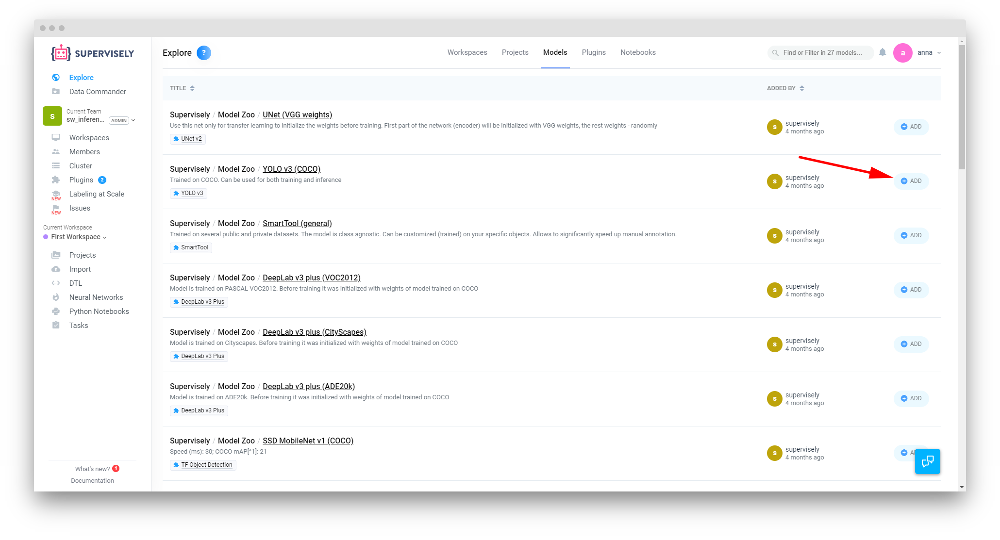
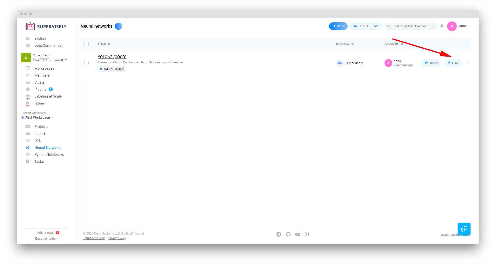
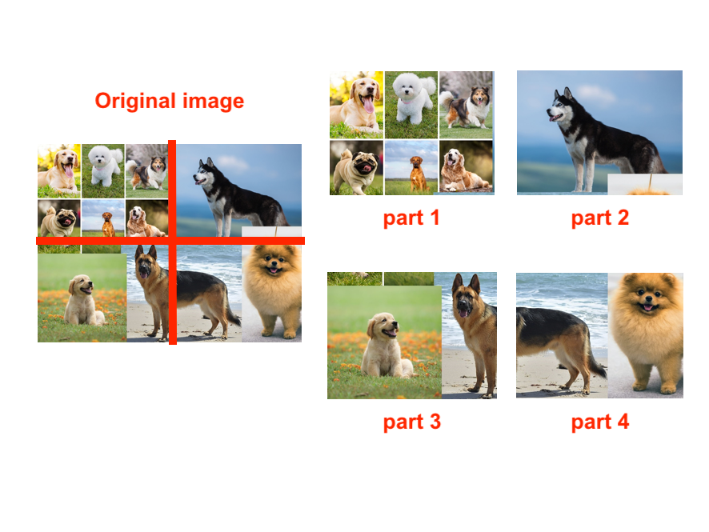
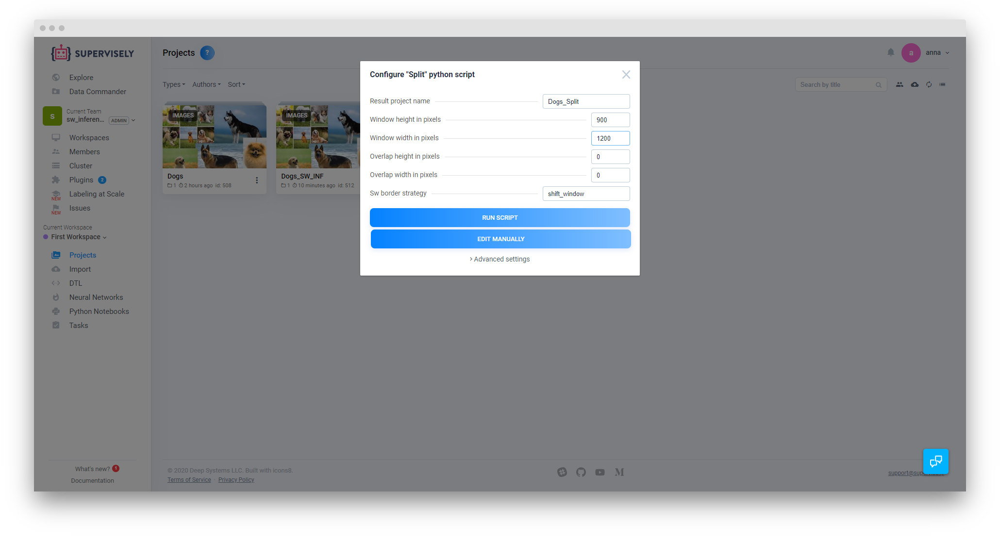
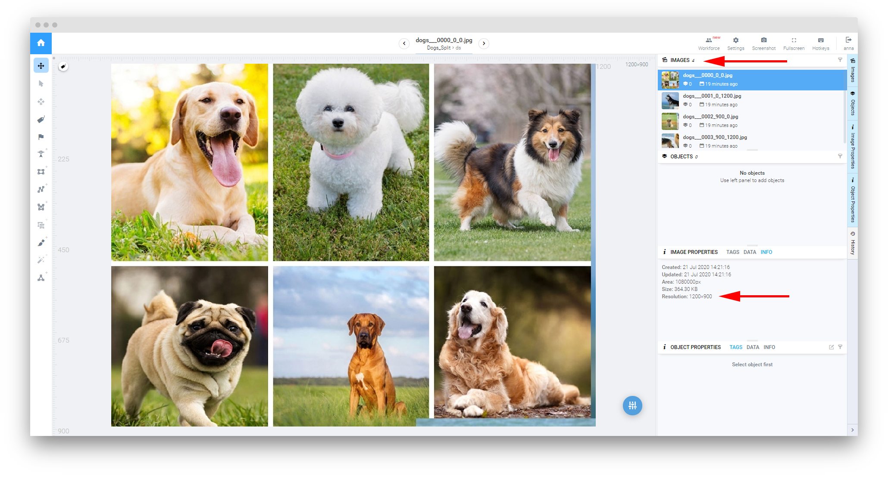
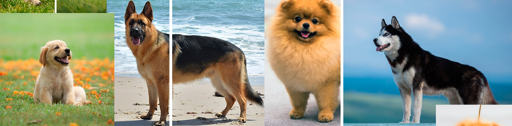
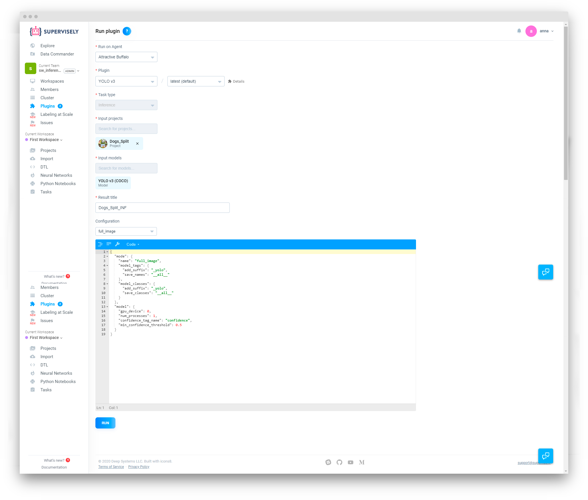
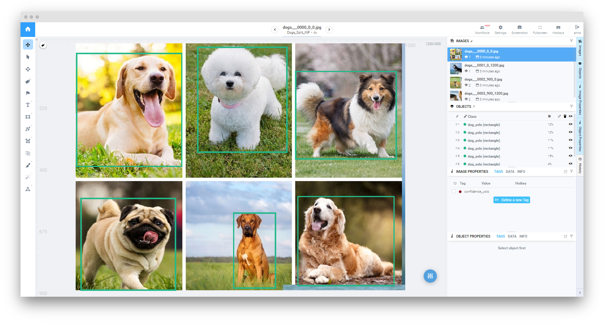
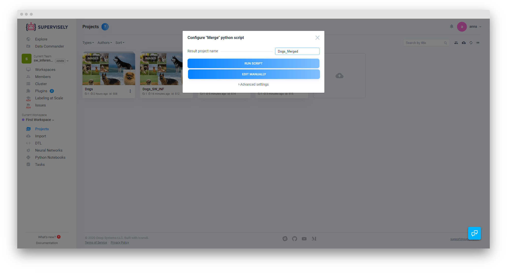
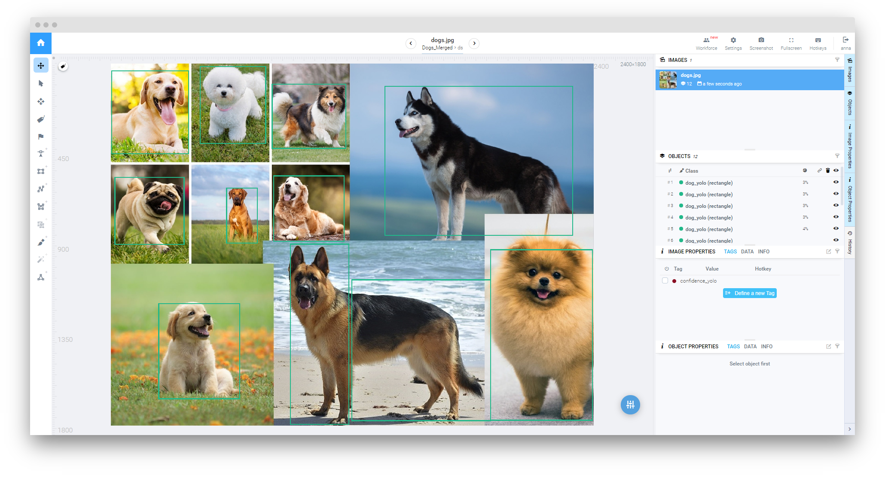

# Sliding Window Inference

Task description: 
1. all our images have the same resolution 
2. we would like to split images to 4 parts, apply NN to these parts and combine results back to single image. 

Supervisely supports several inference modes, including Sliding Window. It's useful for getting inference results on larger images without modifying them during the process. Currently, there are 2 ways in which this method can be used.

## Sliding Window Inference mode for Neural Networks

This is the first and most straightforward method for this type of task. You only need to add a Neural Network model to your account and run it with the appropriate settings.

### Example

Let's start by adding **YOLO v3** model to our account from the Explore page. You can navigate here from the *Explore* page → *Models* or from the *Neural Networks* via the *+ Add* button at the top of that page.



Once we're done that, we can go forward and try the model on our test image. For the purposes of this tutorial it's already uploaded to the platform as a *Dogs* containing a single dataset with a single file in it.


Now we navigate to the Neural networks page and press the *Test* button.



On the next page, we need to select the correct agent node and input project, type in the result title, select and adjust the NN cofig to fit our purposes.


```json
{
  "mode": {
    "name": "sliding_window_det",
    "save": false,
    "window": {
      "width": 1200,
      "height": 900
    },
    "nms_after": {
      "enable": true,
      "iou_threshold": 0.4,
      "confidence_tag_name": "confidence"
    },
    "class_name": "sl_window",
    "model_tags": {
      "add_suffix": "_yolo",
      "save_names": "__all__"
    },
    "min_overlap": {
      "x": 0,
      "y": 0
    },
    "model_classes": {
      "add_suffix": "_yolo",
      "save_classes": "__all__"
    }
  },
  "model": {
    "gpu_device": 0,
    "num_processes": 1,
    "confidence_tag_name": "confidence",
    "min_confidence_threshold": 0.5
  }
}
```

In this particular case, we are only interested in data located at the corners of our image. Also, the image in question is rather large, 2400x1800px. So what we can do in this case, is to set the sliding window mode to 1200X900 - this will force the neural network to treat the image as 4 images of that size and combine the results afterwards. 




Once the task has been processed, we can view the results:


As you can see, the model performed as expected, performing accurately in the corners of the image. This method is fast and easy to use in simple cases.

## Sliding Window Inference using Split and Merge scripts

This method is a bit more involved than the previous one, but it provides a bit more control over the end results, if that's what you need.

### Example

Let's use the same source image and the same **YOLO v3** model as we did before. However, our first step will be quite different: we need to add the custom [Split and Merge scripts](https://github.com/supervisely/supervisely/tree/master/plugins/python/src/examples/001_image_splitter) to our account. Please follow the tutorial provided in the link. Once you're done, you'll be able to call the *Split* script from the Project Context Menu → Run Python Script → Split. This will bring up the following settings window:



Let's apply the same window parameters we used in the first example. As a result, the source image will be split in 4 1200x900 sized parts:



Here's what the 3 other images look like:



Now we can run our Neural Network on these images. Please note that in this case, we need to use the Full Image mode, as we already split the source image in 4 in the previous step.



After the model is done processing the images, let's view the results:



At this step we can adjust the predictions on the individual images. For the purposes of comparison, we won't do it in in this example, but the option to do so is still there. Instead, we'll just merge the images back together using the *Merge script*:



Now let's view what we got as a result:



As you can see, in this case the end results are pretty similar to the previous method, as we skipped adjusting individual annotations a couple steps agp and used the same settings across both examples.

You can choose which method you prefer based on your input images and desired results.
